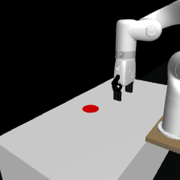
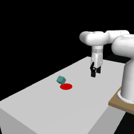
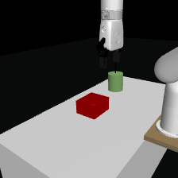
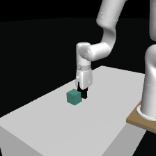
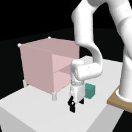
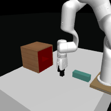

# xArm: a Robotic Environment for Visual/State Reinforcement Learning
More envs are on the way...
| task | action space | visualize |
| --- | --- | --- |
| reach |  xyz  |  |
| push |  xyz  |  |
| pegbox |  xyz  |  |
| lift |  xyzw  |  |
| shelfplacing | xyzw | |
| peginsert | xyzw | |


# Install
create a newconda env (or just install these packages included):
```
conda env create -f environment.yaml
```
And then you could install xArm package by:
```
python setup.py develop
```

# Params
See `example.py` for simple usage.

- observation_type: `state`, `image`, `state+image`. Note that `state+image` means using the robot state (xyzw).
- action_space: `xy`, `xyz`, `xyzw`
- camera_mode: `static`, `static+dynamic`, `dynamic`
- camera_move_range: moving angle of dynamic camera
- domain_randomization: whether to use domain_randomization

